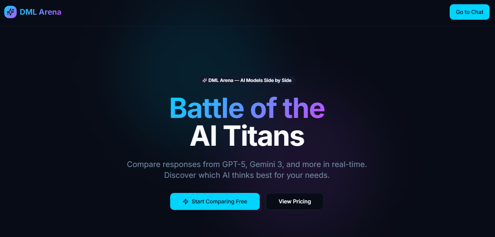
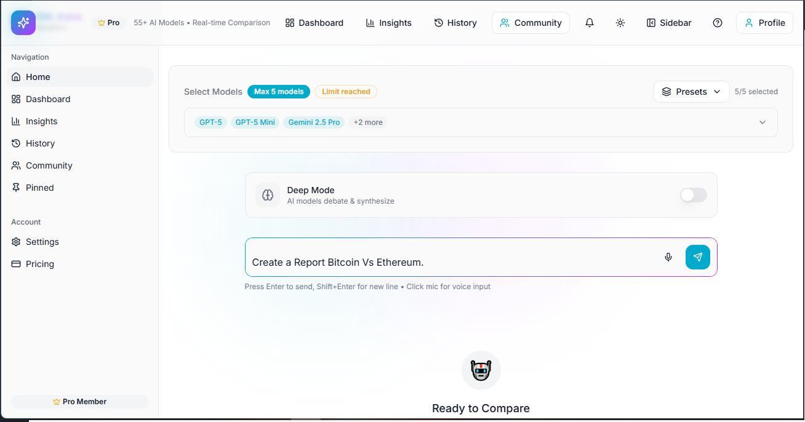
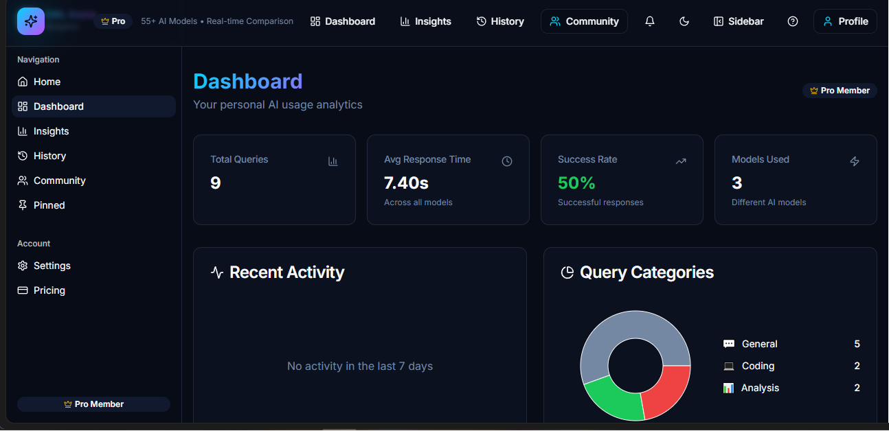
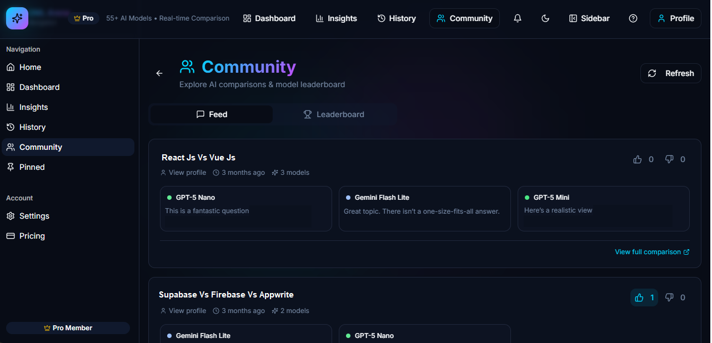
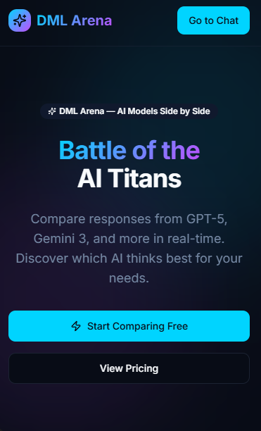
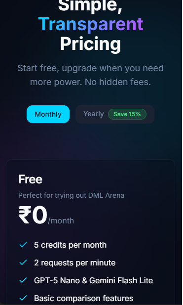

<div align="center">

# DML Arena

### DML Arena: The Open-Source LLM Battleground

[](https://opensource.org/licenses/Apache-2.0)
[](https://www.typescriptlang.org/)
[](https://react.dev/)
[](https://vitejs.dev/)
[](https://tailwindcss.com/)
[](#contributing)

**Developed by [DML Labs](https://github.com/Devmayank-official) · Lead Engineer: [@Devmayank-official](https://github.com/Devmayank-official)**

</div>

---

## Table of Contents

1. [Overview](#overview)
2. [Screenshots](#screenshots)
3. [Why DML Arena](#why-dml-arena)
4. [Feature Matrix](#feature-matrix)
5. [Architecture](#architecture)
6. [Tech Stack](#tech-stack)
7. [Quick Start](#quick-start)
8. [Project Structure](#project-structure)
9. [Engineering Standards](#engineering-standards)
10. [Testing](#testing)
11. [Internationalization](#internationalization)
12. [Accessibility](#accessibility)
13. [Security](#security)
14. [Performance Targets](#performance-targets)
15. [Deployment](#deployment)
16. [Self-Hosting](#self-hosting)
17. [Roadmap](#roadmap)
18. [Contributing](#contributing)
19. [License](#license)
20. [Credits](#credits)

---

## Overview

> DML Arena is an enterprise-grade, open-source evaluation platform architected for rigorous multi-model LLM benchmarking. By providing a unified interface for simultaneous, real-time side-by-side inference, DML Arena eliminates the opacity of vendor-specific model performance. The platform features an advanced "Deep Mode" multi-agent debate engine that autonomously critiques and synthesizes reasoning across iterations, alongside granular telemetry for latency, token efficiency, and comparative success metrics. Built on an opinionated, high-security React and Supabase architecture, DML Arena is engineered to empower organizations with the empirical data required to validate AI reasoning capabilities and optimize model selection for mission-critical workloads.

---

## Screenshots

<div align="center">

### Landing Page


### Home — Multi-Model Compare


### Dashboard — Personal Analytics


### Community Feed & Leaderboard


### Mobile — Landing & Pricing

<p>
  
  &nbsp;&nbsp;
  
</p>

</div>

---

## Why DML Arena

| Pain | DML Arena |
|---|---|
| "Which model should I use?" | Run them all at once and compare verifiable output, not marketing claims. |
| Vendor lock-in | Bring-your-own-key support, open-source, Apache 2.0. |
| Black-box debates | Deep Mode shows every round of model-vs-model critique. |
| Sketchy AI tooling | TypeScript + Zod + RLS + DOMPurify + structured logging end-to-end. |
| "It works on my machine" | First-class self-hosting, Docker-ready, public REST API on the roadmap. |

---

## Feature Matrix

### Core
- 🤖 **Multi-Model Arena** — Stream responses from many models side-by-side with token-by-token streaming.
- 🧠 **Deep Mode** — Multi-round debate + synthesis pipeline for hard questions.
- 🥊 **Battle Mode** *(in progress)* — 1v1 blind comparison with community voting and ELO rankings.
- 🏆 **Leaderboard & Insights** — Per-model performance, latency, win-rate analytics.
- 📌 **Pinning, Favorites, History** — Personal knowledge base of past comparisons.
- 🔗 **Share Links** — Public, signed, read-only links for any comparison.
- 🌐 **Community Feed** — Browse, vote on, and remix shared comparisons.
- 📥 **Export** — Markdown, JSON, PDF, and side-by-side diff exports.

### Platform
- 🔐 **Auth** — Email/password + Google OAuth via Supabase Auth.
- 💳 **Billing** — Razorpay integration (monthly/yearly), free + pro tiers, usage metering.
- 🔔 **Notifications & Realtime** — Supabase Realtime channels.
- 📱 **PWA** — Installable, offline-aware, with a native bottom nav on mobile.
- ⌨️ **Keyboard-First** — Command palette (`⌘K`), full shortcut sheet (`?`).
- 🎨 **Themes** — Light, dark, system; semantic HSL design tokens.
- 🎤 **Voice Input** — Web Speech API.
- 🚦 **Rate-limited & metered** — Per-plan quotas enforced server-side.

---

## Architecture

```
┌───────────────────────────────────────────────────────────────────┐
│                        Browser (PWA)                              │
│  React 18 · TypeScript · Vite · Tailwind · shadcn/ui              │
│  Zustand (UI state) · TanStack Query (server state) · i18next     │
└───────────────────────┬───────────────────────────────────────────┘
                        │ HTTPS · Realtime (WebSocket)
┌───────────────────────▼───────────────────────────────────────────┐
│                        Supabase Backend                           │
│  Postgres + RLS · Auth · Storage · Realtime · Edge Functions      │
└───┬───────────────┬─────────────────┬─────────────────┬───────────┘
    │               │                 │                 │
┌───▼───┐    ┌──────▼──────┐   ┌──────▼──────┐   ┌──────▼──────┐
│ dml-  │    │ dml-arena-  │   │ dml-debate  │   │  razorpay-* │
│ arena │    │  stream     │   │ (deep mode) │   │  (billing)  │
└───┬───┘    └──────┬──────┘   └──────┬──────┘   └─────────────┘
    │               │                 │
    └───────────────┴─────────────────┘
                    │
              ┌─────▼─────┐
              │ OpenRouter │ → OpenAI · Google · Anthropic · others
              │ AI Gateway │   (system fallback for base models)
              └───────────┘
```

**Key principles:**
- **Feature-based modules** (`src/features/*`) with public-API barrel exports.
- **Server state via TanStack Query** — never `useEffect` for data fetching.
- **Zod everywhere** — env, forms, API payloads, edge function bodies.
- **RLS on every table.** Roles in a separate `user_roles` table — never on profiles.
- **DOMPurify on every rendered Markdown surface.**
- **Structured logger** — no raw `console.*` outside bootstrap.

See [`SELF_HOSTING.md`](./SELF_HOSTING.md) for deployment details.

---

## Tech Stack

| Layer | Choice | Why |
|---|---|---|
| Framework | **React 18 + Vite 5** | Fast HMR, code-split per route, small runtime. |
| Language | **TypeScript 5** | End-to-end type safety, Zod-inferred types. |
| Styling | **Tailwind CSS 3 + shadcn/ui** | Semantic HSL tokens, copy-paste accessible primitives. |
| Server state | **TanStack Query v5** | Cache, dedupe, retries, query-key factory. |
| Client state | **Zustand** | Tiny, no boilerplate, devtools. |
| Forms | **React Hook Form + Zod** | One source of truth for validation. |
| Routing | **React Router 6** | Lazy routes, nested layouts. |
| Backend | **Supabase** | Postgres, Auth, Storage, Realtime, Edge Functions. |
| AI | **OpenRouter + AI Gateway** | Bring-your-own-key or system fallback across many providers. |
| Payments | **Razorpay** | India-first, multi-currency, subscriptions. |
| Sanitization | **DOMPurify + marked** | Safe Markdown rendering. |
| i18n | **i18next + react-i18next** | English baseline, drop-in locales. |
| Testing | **Vitest + Testing Library** | Fast, ESM-native, jest-compatible API. |
| Logging | **Custom structured logger** | Tagged events, environment-aware. |

---

## Quick Start

### Prerequisites
- **Node.js 20+** (use `nvm install 20`)
- **npm**, **pnpm**, or **bun**

### Local development

```bash
# 1. Clone
git clone https://github.com/Devmayank-official/dml-arena.git
cd dml-arena

# 2. Install
npm install

# 3. Configure environment
cp env.example .env
#   → fill in VITE_SUPABASE_URL, VITE_SUPABASE_PUBLISHABLE_KEY, VITE_SUPABASE_PROJECT_ID

# 4. Run
npm run dev
#   → http://localhost:8080
```

### Available scripts

| Command | Purpose |
|---|---|
| `npm run dev` | Start Vite dev server with HMR. |
| `npm run build` | Production build to `dist/`. |
| `npm run preview` | Preview the production build. |
| `npm run lint` | Run ESLint. |
| `npx vitest` | Run unit tests in watch mode. |
| `npx vitest run` | Run unit tests once (CI). |

---

## Project Structure

```
src/
├── components/         # Shared UI (shadcn primitives + composed widgets)
│   ├── a11y/          # Accessibility helpers (SkipToContent, …)
│   ├── ui/            # shadcn/ui primitives
│   └── …
├── features/          # Feature-based modules with barrel exports
│   ├── arena/         # Multi-model comparison (the core experience)
│   ├── auth/          # Sign in / sign up / session
│   ├── community/     # Public feed + voting
│   ├── debate/        # Deep Mode (multi-round)
│   ├── export/        # Markdown / PDF / JSON / diff exports
│   ├── history/       # Personal comparison history
│   ├── leaderboard/   # Model rankings + charts
│   ├── settings/      # Profile, API keys, preferences
│   └── subscription/  # Razorpay billing
├── hooks/             # Cross-cutting hooks (auth, toast, shortcuts, …)
├── stores/            # Zustand stores (auth, ui, settings, arena)
├── lib/               # Pure utilities (schemas, logger, exporters, …)
├── constants/         # Validated config, routes, query-key factory
├── i18n/              # i18next setup + locale files
├── integrations/      # Auto-generated Supabase client + types
├── pages/             # Route-level components (lazy-loaded)
└── test/              # Vitest setup
supabase/
├── functions/         # Edge functions (Deno)
└── migrations/        # SQL migrations (read-only)
screenshots/           # UI reference screenshots used in this README
```

---

## Engineering Standards

DML Arena enforces strict production guardrails across the codebase:

- ✅ **No `any`.** Strict types or Zod-inferred types.
- ✅ **No raw `console.*`** outside bootstrap — use the structured `logger`.
- ✅ **No hardcoded route strings** — import from `@/constants` (`ROUTES`).
- ✅ **No raw `import.meta.env`** — go through validated `config`.
- ✅ **All forms = React Hook Form + Zod.**
- ✅ **All server data = TanStack Query** with the `queryKeys` factory.
- ✅ **All global state = Zustand.**
- ✅ **DOMPurify on all rendered Markdown.**
- ✅ **Components < 150 lines of JSX**, named exports for feature components.
- ✅ **Apply SOLID, DRY, KISS, YAGNI** at every refactor.

---

## Testing

```bash
npx vitest          # watch mode
npx vitest run      # CI
```

- **Vitest + jsdom** for unit/component tests.
- **@testing-library/react + user-event** for behavior-driven tests.
- **Playwright** (planned) for critical-path E2E (auth, compare, share, vote).

Tests live alongside the code:

```
src/lib/__tests__/utils.test.ts
src/lib/__tests__/schemas.test.ts
src/test/setup.ts
```

---

## Internationalization

i18n is wired with **i18next + react-i18next** and a browser language detector. The app ships **English-only** at launch by design; adding a locale is a one-file change:

```ts
// src/i18n/locales/es.ts
export const es = { common: { appName: "DML Arena", … } };

// src/i18n/index.ts
resources: { en: { translation: en }, es: { translation: es } },
supportedLngs: ["en", "es"],
```

In components:

```tsx
import { useTranslation } from "react-i18next";
const { t } = useTranslation();
return <button>{t("common.save")}</button>;
```

---

## Accessibility

DML Arena targets **WCAG 2.1 AA** and **Lighthouse Accessibility ≥ 90**.

- ⏭️ **Skip-to-content** link on every page (`<SkipToContent />`).
- 🎯 Visible **focus rings** via `focus-visible:ring-2 ring-ring ring-offset-2`.
- 🏷️ **Semantic landmarks** (`<main>`, `<nav>`, `<header>`) and ARIA labels on icon-only buttons.
- 🎨 Color tokens chosen for **AA contrast** in both light and dark themes.
- ⌨️ Full **keyboard navigation** + `?` shortcut sheet + `⌘K` palette.
- 📢 `aria-live` regions for streaming responses and toasts.
- 🚫 **Respects `prefers-reduced-motion`** for animations.

---

## Security

- 🔒 **Row-Level Security** on every table; roles isolated in `user_roles`.
- 🛡️ **DOMPurify** sanitizes every Markdown render path.
- 🔑 **Secrets** live in Supabase Vault / Edge Function secrets — never in code, never in `localStorage`.
- ✅ **Zod-validated** environment, request bodies, and form input.
- 🧱 **CSP-friendly** build, no inline scripts.
- 🪪 **JWT-verified edge functions** for any user-scoped action.
- 📜 **Structured audit logging** via the `logger` (no PII leaks).

Report a vulnerability: open a private security advisory on GitHub or email **security@dmllabs.dev**.

---

## Performance Targets

| Metric | Target |
|---|---|
| Lighthouse Performance | **≥ 90** |
| Lighthouse Accessibility | **≥ 90** |
| Largest Contentful Paint | **< 2.5s** |
| First Input Delay | **< 100ms** |
| Cumulative Layout Shift | **< 0.1** |
| Initial JS bundle (gzip) | **< 200 KB** |
| Per-route chunk (gzip) | **< 100 KB** |

Hit via: route-level code splitting, lazy pages, semantic skeleton fallbacks, image lazy-loading, and Tailwind's JIT purge.

---

## Deployment

### Self-hosted
Any static host works for the frontend (Vercel, Netlify, Cloudflare Pages, S3+CloudFront, nginx). The backend is provisioned on your own Supabase project. See [`SELF_HOSTING.md`](./SELF_HOSTING.md).

```bash
npm run build
# → ship dist/ to your static host
```

---

## Self-Hosting

DML Arena is **fully self-hostable**. You'll need:

1. A Supabase project (or self-hosted Supabase) with the migrations applied.
2. Edge functions deployed (`supabase functions deploy`).
3. Frontend `.env` pointing at your project.
4. Razorpay keys *(optional, only if you enable billing)*.
5. AI provider keys *(OpenRouter recommended, or wire your own in the edge functions)*.

Step-by-step in [`SELF_HOSTING.md`](./SELF_HOSTING.md).

---

## Roadmap

- [x] **Phase 1** — Foundation hardening (Zod, TanStack Query, types, error boundaries).
- [x] **Phase 2** — Feature-based architecture, Zustand stores, decomposition.
- [ ] **Phase 3** — 1v1 Blind Battle Mode + ELO + cost/latency metrics.
- [ ] **Phase 4** — Public REST API + Admin Dashboard + Vision/Code arenas.
- [ ] **Phase 5** — Critical-path E2E (Playwright) + visual regression.

---

## Contributing

We love contributions. The short version:

1. Open an issue describing the change *before* large PRs.
2. `npx vitest run && npm run lint && npm run build` must pass.
3. Keep PRs small, focused, and well-described.

```bash
git checkout -b feat/your-thing
# code…
npx vitest run && npm run lint
git commit -m "feat(scope): your thing"
```

---

## License

Licensed under the **Apache License, Version 2.0**. See [`LICENSE`](./LICENSE).

```
Copyright 2025 DML Labs

Licensed under the Apache License, Version 2.0 (the "License");
you may not use this file except in compliance with the License.
You may obtain a copy of the License at

    http://www.apache.org/licenses/LICENSE-2.0

Unless required by applicable law or agreed to in writing, software
distributed under the License is distributed on an "AS IS" BASIS,
WITHOUT WARRANTIES OR CONDITIONS OF ANY KIND, either express or implied.
```

---

## Credits

<div align="center">

**Developed by [DML Labs](https://github.com/Devmayank-official)**
Lead Engineer · [**@Devmayank-official**](https://github.com/Devmayank-official)

Built with ❤️ and an absurd amount of TypeScript.

</div>
